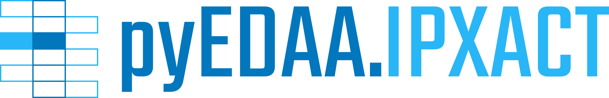

  

  

  

<!--

-->

An IP-XACT Document Object Model (DOM) for [IEEE 1685-2022][IEEE-1685-2022] written in Python.

# Features

* Generate IP-XACT files for
  * IP-XACT catalogs

# IP-XACT Resources

* Standards:
  * [IEEE 1685-2009][IEEE-1685-2009]
  * [IEEE 1685-2014][IEEE-1685-2014]
  * [IEEE 1685-2022][IEEE-1685-2022]
* Schema files:
  * [IPXACT-Schema](https://github.com/edaa-org/IPXACT-Schema) at GitHub
  * [IP-XACT][IPXACT] at [Accellera][Accellera]

# Contributors

* [Patrick Lehmann](https://github.com/Paebbels) (Maintainer)

# License

This Python package (source code) is licensed under [Apache License 2.0](LICENSE.md).  
The accompanying documentation is licensed under [Creative Commons - Attribution 4.0 (CC-BY 4.0)](doc/Doc-License.rst).

-------------------------
SPDX-License-Identifier: Apache-2.0

[IEEE-1685-2009]: https://standards.ieee.org/findstds/standard/1685-2009.html
[IEEE-1685-2014]: https://standards.ieee.org/findstds/standard/1685-2014.html
[IEEE-1685-2022]: https://standards.ieee.org/findstds/standard/1685-2022.html
[IPXACT]:         http://accellera.org/downloads/standards/ip-xact
[Accellera]:      http://accellera.org
